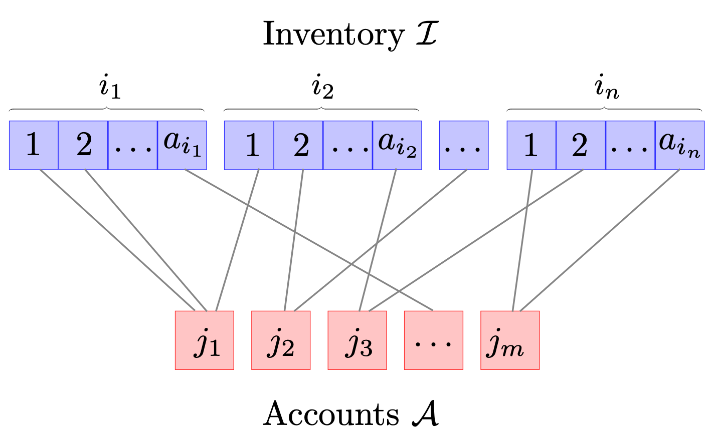

# Collateral-Optimization
Collateral Optimization using MILP and QUBO formulations. 

<h2>Generic Information</h2>

In this repository we provide the code used to generate the numericall illustrations on [arxiv identifier]. In this paper we study the problem of collateral optimization. In the afformentioned paper we:
1. Review the problem of collateral optimization with a small appetizer (that serves to explain our approach) using the Knapsack Problem.
2. Provide a Mixed Integer Linear Programming (MILP) formulation. 
3. Provide two approaches to reformulate the MILP problem as a Quadratic Unconstrained Binary Optimization (QUBO) problem. These include:   
  a) Slack-based (balanced) formulation (see, for example, arXiv:1302.5843).  
  b) Unbalansed formulation (see arXiv:2211.13914)
4. Provide some numerical illustrations done with emulators (i.e. by utilizing simmulated annealing) and discuss the results.

<h2>Contents</h2>
